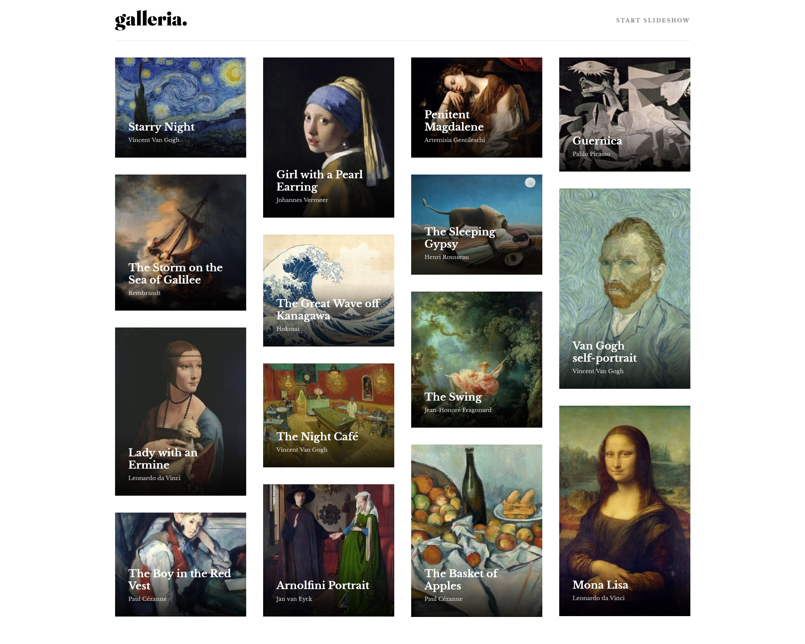

# Galleria - Landing page

A landing page for an art gallery, containing a grid of images and a link to their descriptions.

### Layout

### Links

- [GitHub](https://link)
- [Website Live](https://link)

## Overview

Users should be able to:

- View the optimal layout for the app depending on their device's screen size
- See hover states for all interactive elements on the page
- Navigate the slideshow and view each painting in a lightbox

### Tools

- React
- React-Router-Dom
- Styled Components
- Framer-Motion
- Macy.js
- Redux Toolkit
- TypeScript
- Mobile-first workflow
